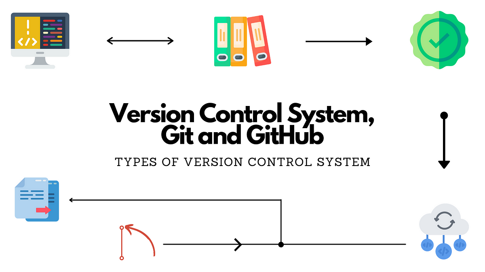
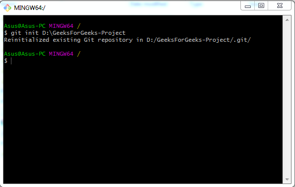

# Basic Git Interview Questions & Answers

### 1. What is Git?

Git is a version control system for tracking changes in computer files and is used to help coordinate work among several people on a project while tracking progress over time. In other words, it’s a tool that facilitates source code management in software development.

Git favors both programmers and non-technical users by keeping track of their project files. It enables multiple users to work together and handles large projects efficiently.

### 2. What do you understand by the term ‘Version Control System’?

A version control system (VCS) records all the changes made to a file or set of data, so a specific version may be called later if needed.

This helps ensure that all team members are working on the latest version of the file

### 3. What is GitHub?

To provide Internet hosting for version control and software development, GitHub makes use of Git.

### 4. Mention some popular Git hosting services

- GitHub
- SourceForge
- GitLab
- Bitbucket

### 5. Different types of version control systems?

- Local version control systems have a database that stores all file changes under revision control on disc in a special format.
- Centralized version control systems have a single repository, from which each user receives their working copy.
- Distributed version control systems contain multiple repositories, and different users can access each one with their working copy.

### 6. What benefits come with using GIT?

- Data replication and redundancy are both possible.
- It is a service with high availability.
- There can only be one Git directory per repository.
- Excellent network and disc performance are achieved.
- On any project, collaboration is very simple.

### 7. What’s the difference between Git and GitHub?

#### GIT

- Git is a software.
- Git can be installed locally on the system.
- Provides a desktop interface called git GUI.
- It does not support user management features,

#### GITHUB

- GitHub is a service.
- GitHub is hosted on the web.
- Provides a desktop interface called GitHub Desktop.
- Provides built-in user management.

### 8. What is a Git repository?

Git repository refers to a place where all the Git files are stored. These files can either be stored on the local repository or on the remote repository.

### 9. How can you initialize a repository in Git?

If you want to initialize an empty repository to a directory in Git, you need to enter the git init command. After this command, a hidden .git folder will appear.

### 10. How is Git different from Subversion (SVN)?

#### GIT

- Git is a distributed decentralized version control system.
- Git stores content in the form of metadata.
- The master contains the latest stable release.
- The contents of Git are hashed using the SHA-1 hash algorithm.

#### SVN

- SVN is a centralized version control system.
- SVN stored data in the form of files.
- In SVN, the trunk directory has the latest stable release.
- SVN doesn’t support hashed contents.

### 11. Name a few Git commands with their function?

- Git config - Configure the username and email address.
- Git add - Add one or more files to the staging area.
- Git diff - View the changes made to the file.
- Git init - Initialize an empty Git repository.
- Git commit - Commit changes to head but not to the remote repository.

### 12. What are the advantages of using Git?

- Faster release cycles.
- Easy team collaboration.
- Widespread acceptance.
- Maintains the integrity of source code.
- Pull requests.

### 13. What language is used in Git?

Git is a fast and reliable version control system, and the language that makes this possible is ‘C’.

Using C language reduces the overhead of run times, which are common in high-level languages.

### 14. What is the correct syntax to add a message to a commit?

 git commit -m "x files created"

### 15. Which command is used to create an empty Git repository?

git init - This command helps to create an empty repository while working on a project.

### 16. What does git pull origin master do?

The git pull origin master fetches all the changes from the master branch onto the origin and integrates them into the local branch.

git pull = git fetch + git merge origin/ master

After having gone through the beginner level Git interview questions, let us now look at intermediate GIT interview questions and answers.
